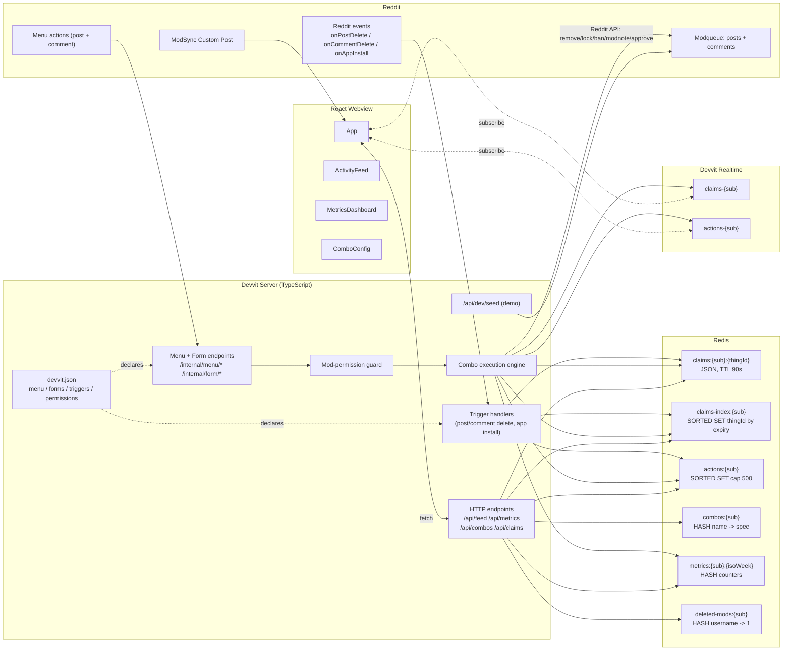

# Design Document

## Overview

ModSync runs entirely on Devvit Web. The server side is a TypeScript Devvit app whose menu items, forms, triggers, permissions, custom post, and settings are wired declaratively in `devvit.json`. Endpoints are Hono-style routes from `@devvit/web/server`. The server talks to Redis for all persistent state and uses Devvit Realtime for fan-out. The client is a React webview custom post with three tabs: Activity Feed, Metrics Dashboard, Combo Config.

There are no external services. All P0 features and the Deletion Compliance triggers run entirely on Devvit primitives.

## Architecture



Key flows:

- **Claim**: menu endpoint -> auth guard -> `SET claims:{sub}:{thingId} EX 90` + `zAdd claims-index:{sub} { score: now + 90000, member: thingId }` -> publish `claim` to `claims-{sub}`.
- **Combo**: "Run combo…" menu endpoint -> auth guard -> returns `showForm` for the combo picker populated from `combos:{sub}` -> form submit endpoint -> if foreign claim, returns `showForm` for soft warning -> on accept, refresh claim, run executor -> sequential step execution against Reddit API -> append to `actions:{sub}`, publish to `actions-{sub}` -> `DEL claims:{sub}:{thingId}` + `zRem claims-index:{sub} thingId` -> publish `release`.
- **Webview load**: client fetches `/api/feed`, `/api/metrics`, `/api/combos`, `/api/claims` in parallel during initial render, then subscribes to both realtime channels and merges incoming events into local state.
- **Deletion compliance**: Devvit dispatches `onPostDelete` / `onCommentDelete` events to dedicated trigger endpoints, which scrub `actions:{sub}` and the matching `claims:{sub}:{thingId}` key (plus `claims-index:{sub}`) for the affected ids. Account-deletion compliance is handled lazily on read via `deleted-mods:{sub}`, since Devvit has no `onAccountDelete` trigger and Redis is per-install-namespaced.

## Components and Interfaces

ModSync's wiring lives in `devvit.json`. That file declares:

- `name` — required app account name (3-16 chars, lowercase + hyphens)
- `post.entrypoints.default` — the React webview entry HTML and height
- `server.entry` — the compiled CJS server bundle path
- `menu.items` — the two fixed menu items (Claim for review, Run combo…)
- `forms` — named forms (`softWarningForm`, `comboPickerForm`, `comboEditorForm`) each pointing at a server endpoint that handles submit
- `triggers` — `onAppInstall`, `onPostDelete`, `onCommentDelete` mapped to handler endpoints
- `permissions.reddit` (`scope: "moderator"`), `permissions.redis: true`, `permissions.realtime: true`
- `marketingAssets.icon` — 1024x1024 PNG for App Directory listing
- `scripts.dev` and `scripts.build` — Devvit CLI hooks (the build script must emit a CJS server bundle)

### Server modules

- `src/server/main.ts` — Devvit Web entry. Builds a Hono-style app from `@devvit/web/server`, registers routes for menu endpoints (`app.post("/internal/menu/claim", ...)` etc.), form-submit endpoints, trigger endpoints, and `/api/*` endpoints. All declarative wiring (which menu item invokes which endpoint, which trigger event maps to which endpoint) lives in `devvit.json` rather than at runtime.
  - **Build constraint:** the server bundle must be CommonJS, not ESM. The build script in `devvit.json` uses `esbuild` with `--format=cjs --platform=node` to compile `src/server/main.ts` into `dist/server/index.cjs`. The client is built by Vite as ESM into `dist/client/` (referenced by `post.dir`).
- `src/server/auth.ts` — `requireMod(ctx) -> Promise<{ user, sub }>`. Calls `reddit.getCurrentUser()`, then checks `HEXISTS mods:{sub} {username}` against the moderator cache; on hit, returns immediately. On miss or stale cache (`mods-expiry:{sub}` missing), calls `reddit.getModerators(sub)`, populates `mods:{sub}` and resets the 5-minute `mods-expiry:{sub}` sentinel, then verifies membership. Throws `ForbiddenError` if the user is not in the moderator list. Wraps every menu endpoint, every form endpoint, and every mutating `/api/*` endpoint.
- `src/server/claims.ts` — `claim`, `release`, `refresh`, `getClaim`, `listActiveClaims`. Maintains the `claims-index:{sub}` sorted set for active-claim listing (Devvit Redis has no SCAN).
- `src/server/combos.ts` — `saveCombo`, `deleteCombo`, `listCombos`, `validateCombo`.
- `src/server/executor.ts` — `runCombo(thingId, combo, mod)`.
- `src/server/feed.ts` — `appendAction`, `readFeed(limit)`, `purgeByThingId(sub, thingId)`.
- `src/server/scrub.ts` — `isModeratorDeleted(sub, username)` (check + cache via `deleted-mods:{sub}` hash); `scrubEntry(sub, entry)` (mutate moderator -> `"[deleted]"` if cached deleted).
- `src/server/metrics.ts` — `bumpMetric(sub, kind)`, `getMetrics(sub, period)`, `isoWeekKey(date)`.
- `src/server/triggers/postDelete.ts` — handler for `onPostDelete`.
- `src/server/triggers/commentDelete.ts` — handler for `onCommentDelete`.
- `src/server/triggers/appInstall.ts` — handler for `onAppInstall`.
- `src/server/seed.ts` — demo seed handler.

`@devvit/web/shared` is used for typed request/response shapes (`MenuItemRequest`, `UiResponse`, `FormSubmitRequest`, etc.) on both the menu and form endpoints.

### devvit.json

Representative shape:

```json
{
  "$schema": "https://developers.reddit.com/schema/config-file.v1.json",
  "name": "modsync-set",
  "post": {
    "dir": "dist/client",
    "entrypoints": {
      "default": { "entry": "index.html", "height": "tall" }
    }
  },
  "server": {
    "entry": "dist/server/index.cjs"
  },
  "permissions": {
    "reddit": { "enable": true, "scope": "moderator" },
    "redis": true,
    "realtime": true
  },
  "menu": {
    "items": [
      { "label": "Claim for review", "forUserType": "moderator", "location": ["post", "comment"], "endpoint": "/internal/menu/claim" },
      { "label": "Run combo…", "forUserType": "moderator", "location": ["post", "comment"], "endpoint": "/internal/menu/combo-picker" }
    ]
  },
  "forms": {
    "softWarningForm": "/internal/form/soft-warning-submit",
    "comboPickerForm": "/internal/form/combo-picker-submit",
    "comboEditorForm": "/internal/form/combo-editor-submit"
  },
  "triggers": {
    "onAppInstall": "/internal/trigger/app-install",
    "onPostDelete": "/internal/trigger/post-delete",
    "onCommentDelete": "/internal/trigger/comment-delete"
  },
  "marketingAssets": {
    "icon": "assets/icon.png"
  },
  "scripts": {
    "dev": "vite build --watch",
    "build": "vite build && esbuild src/server/main.ts --bundle --platform=node --format=cjs --outfile=dist/server/index.cjs"
  },
  "dev": {
    "subreddit": "Modsynnow"
  }
}
```

Schema notes (verified against https://developers.reddit.com/schema/config-file.v1.json):
- `name` is required (3-16 chars, lowercase + hyphens) and serves as the app account name + community URL slug.
- `post.entrypoints.default.entry` points to the client HTML built by Vite into `dist/client/`. There is no `customPost` field in the schema.
- `server.entry` points to a **CommonJS** bundle. The Devvit Web runtime does not support ES module output for the server — the `scripts.build` line above uses `esbuild` to emit CJS for the server while Vite emits ESM for the client.
- `permissions.redis` and `permissions.realtime` are booleans, not objects.
- `permissions.reddit.scope: "moderator"` is the correct value for an app that exclusively serves moderator workflows.
- `marketingAssets.icon` is a 1024x1024 PNG required for App Directory listing.
- `dev.subreddit` sets the default playtest subreddit; `DEVVIT_SUBREDDIT` env var overrides it.

### Webview modules

- `src/client/App.tsx` — top-level tab router and realtime wiring.
- `src/client/tabs/ActivityFeed.tsx`
- `src/client/tabs/MetricsDashboard.tsx`
- `src/client/tabs/ComboConfig.tsx`
- `src/client/api.ts` — typed fetch wrappers.
- `src/client/realtime.ts` — `useRealtime(channel, onEvent)` hook over Devvit Realtime.
- `src/client/types.ts` — shared with server.

## Data Models

### Redis schema

| Key | Type | Value shape | TTL | Cap policy |
| --- | --- | --- | --- | --- |
| `claims:{sub}:{thingId}` | STRING (JSON) | `{ moderator: string, claimedAt: number }` | 90s | One key per item; auto-expires |
| `claims-index:{sub}` | SORTED SET | member = thingId, score = expiry epoch ms | none (manual prune) | `zAdd` on claim, `zRem` on release; `zRangeByScore (now, +inf)` to read active claims |
| `actions:{sub}` | SORTED SET | member = JSON `ActionEntry`, score = `entry.ts` (epoch ms) | none | `zAdd` then `zRemRangeByRank 0 -501` to keep newest 500 (cap 500) |
| `combos:{sub}` | HASH | field = combo name, value = JSON `ComboSpec` | none | Hard cap 50 combos per sub, enforced in `saveCombo` |
| `metrics:{sub}:{isoWeek}` | HASH | fields: `softWarningsShown`, `collisionsDetected`, `redundantActionsAvoided` | 60 days | `HINCRBY` only |
| `deleted-mods:{sub}` | HASH | field = username, value = `"1"` | none | Append-only; entries persist for audit |
| `mods:{sub}` | HASH | field = username, value = `"1"` | refreshed via 5-min sentinel | Populated on miss in `requireMod` and warm-filled on `onAppInstall` |
| `mods-expiry:{sub}` | STRING | sentinel `"1"` | 300s (5 min) | Existence gates whether `mods:{sub}` is fresh |

`isoWeek` format: `YYYY-Www` in UTC, e.g. `2025-W42`. Week computed via ISO 8601: Monday-start, week 1 contains the first Thursday.

### TypeScript types

```ts
export type ThingId = `t1_${string}` | `t3_${string}`;

export interface ClaimRecord {
  moderator: string;
  claimedAt: number; // epoch ms
}

export type StepKind = "REMOVE" | "LOCK" | "BAN" | "MODNOTE" | "APPROVE";

export type ComboStep =
  | { kind: "REMOVE" }
  | { kind: "LOCK" }
  | { kind: "APPROVE" }
  | { kind: "BAN"; days: number; reason: string }
  // MODNOTE.text validator caps length at 1000 chars to keep payloads under the 4MB Devvit Web request limit even with 50 combos.
  | { kind: "MODNOTE"; text: string; label?: "ABUSE_WARNING" | "SPAM_WARNING" | "HELPFUL_USER" | "OTHER" };

export interface ComboSpec {
  name: string;          // unique within sub, [a-z0-9-_ ]{1,40}
  steps: ComboStep[];    // length >= 1
  description?: string;
}

export interface ActionEntry {
  id: string;            // ulid
  ts: number;            // epoch ms
  moderator: string;
  thingId: ThingId;
  comboName: string | "Claim";
  ranSteps: ComboStep[];     // steps that actually executed
  failedStepIndex?: number;  // present iff partial failure
  failureMessage?: string;
}

export type RealtimeEvent =
  | { type: "claim"; thingId: ThingId; moderator: string; claimedAt: number; ttlSec: number }
  | { type: "release"; thingId: ThingId; moderator: string; reason: "completed" | "expired" | "manual" }
  | { type: "action"; entry: ActionEntry };

export interface MetricsBucket {
  softWarningsShown: number;
  collisionsDetected: number;
  redundantActionsAvoided: number;
}
```

## Menu Action Handlers

Menu items are declared in `devvit.json` (no runtime registration). Two fixed items, both for moderators only, both available on posts and comments:

| Menu label | Location | Endpoint | Purpose |
| --- | --- | --- | --- |
| `Claim for review` | post, comment | `/internal/menu/claim` | Write claim, publish event |
| `Run combo…` | post, comment | `/internal/menu/combo-picker` | Show combo picker form |

### Claim handler algorithm

```
POST /internal/menu/claim  (body: MenuItemRequest with postId|commentId)
  { user, sub } = requireMod(ctx)
  thingId = postId ?? commentId
  existing = GET claims:{sub}:{thingId}
  if existing and existing.moderator != user:
    HINCRBY metrics:{sub}:{week} softWarningsShown 1
    return UiResponse {
      showForm: {
        name: "softWarningForm",
        form: { fields: [warningTextField], acceptLabel: "Claim anyway", cancelLabel: "Cancel" },
        data: { kind: "claim", thingId }
      }
    }
  SET claims:{sub}:{thingId} {moderator: user, claimedAt: now} EX 90
  publish(claims-{sub}, { type: "claim", thingId, moderator: user, claimedAt: now, ttlSec: 90 })
  return UiResponse { showToast: "Claimed" }
```

### Combo Picker Flow

ModSync cannot register one menu item per combo at runtime; Devvit Web menu items are static. Instead, a single fixed `Run combo…` menu item drives a two-step flow that always reflects the current combo set.

1. Mod clicks **Run combo…** on a post or comment.
2. `POST /internal/menu/combo-picker` runs `requireMod`, then `HKEYS combos:{sub}` to load the current combo names, and returns:

   ```ts
   return UiResponse {
     showForm: {
       name: "comboPickerForm",
       form: {
         title: "Run combo",
         fields: [{ name: "comboName", type: "select", label: "Combo", options: comboNames.map(n => ({ value: n, label: n })) }],
         acceptLabel: "Run",
       },
       data: { thingId }
     }
   }
   ```

3. The mod selects a combo and clicks **Run**.
4. Reddit posts the form to `/internal/form/combo-picker-submit` with `{ comboName }` plus `data.thingId` and the `MenuItemRequest` context.
5. The handler runs:

   ```
   POST /internal/form/combo-picker-submit
     { user, sub } = requireMod(ctx)
     { comboName } = body.values
     { thingId }   = body.data
     combo = HGET combos:{sub} comboName  // 404 if missing
     existing = GET claims:{sub}:{thingId}
     if existing and existing.moderator != user:
       HINCRBY softWarningsShown 1
       return UiResponse {
         showForm: {
           name: "softWarningForm",
           form: { fields: [warningTextField], acceptLabel: "Run anyway", cancelLabel: "Cancel" },
           data: { kind: "combo", thingId, comboName }
         }
       }
     SET claims:{sub}:{thingId} {moderator: user, claimedAt: now} EX 90
     publish(claims-{sub}, claim event)
     await runCombo(thingId, combo, user, sub)
     return UiResponse { showToast: "Combo complete" }
   ```

6. Because the picker rebuilds its options every time it opens, the 5-second freshness requirement (Requirements 1.4 / 6.3) is satisfied without any cache invalidation: a combo that was created 1 second ago is already in the dropdown the next time a mod clicks **Run combo…**.

## Combo Execution Engine

```ts
async function runCombo(thingId: ThingId, combo: ComboSpec, mod: string, sub: string) {
  const ranSteps: ComboStep[] = [];
  let failedIndex: number | undefined;
  let failureMessage: string | undefined;

  for (let i = 0; i < combo.steps.length; i++) {
    const step = combo.steps[i];
    try {
      // refresh claim before each step so a long combo cannot expire under us
      await redis.set(`claims:${sub}:${thingId}`, JSON.stringify({ moderator: mod, claimedAt: Date.now() }), { ex: 90 });
      await dispatch(step, thingId, mod);
      ranSteps.push(step);
    } catch (err) {
      failedIndex = i;
      failureMessage = String(err?.message ?? err);
      break;
    }
  }

  const entry: ActionEntry = {
    id: ulid(),
    ts: Date.now(),
    moderator: mod,
    thingId,
    comboName: combo.name,
    ranSteps,
    failedStepIndex: failedIndex,
    failureMessage,
  };

  await redis.zAdd(`actions:${sub}`, { score: entry.ts, member: JSON.stringify(entry) });
  await redis.zRemRangeByRank(`actions:${sub}`, 0, -501); // keep newest 500 by score
  await realtime.publish(`actions-${sub}`, { type: "action", entry });

  await redis.del(`claims:${sub}:${thingId}`);
  await realtime.publish(`claims-${sub}`, {
    type: "release", thingId, moderator: mod,
    reason: failedIndex === undefined ? "completed" : "manual",
  });
}

function dispatch(step: ComboStep, thingId: ThingId, mod: string) {
  switch (step.kind) {
    case "REMOVE":   return reddit.remove(thingId);
    case "APPROVE":  return reddit.approve(thingId);
    case "LOCK":     return reddit.lock(thingId);
    case "BAN":      return reddit.banUser({ thingId, days: step.days, reason: step.reason, by: mod });
    case "MODNOTE":  return reddit.addModNote({ thingId, text: step.text, label: step.label, by: mod });
  }
}
```

Partial failure is observable in the action log and in the published realtime event so the feed shows a "(failed at step 3)" badge without an extra fetch.

**Combo step count cap.** The Devvit Web server has a 30-second max request time. To stay safely under that bound even when individual Reddit API calls run slow, the combo validator (Property 7) caps `combo.steps.length` at 10. The default combo set ships with 2-3 steps; ten is generous enough for any practical workflow and bounds total combo runtime to ~3 seconds at worst-case 300ms/step.

## Webview Application

```
<App>
  ├ <Tabs value={tab} onChange={setTab}>
  │   ├ <ActivityFeed feed={feed} claims={claims} />
  │   ├ <MetricsDashboard metrics={metrics} />
  │   └ <ComboConfig combos={combos} canEdit={isMod} />
</App>
```

The soft-warning prompt is rendered by Reddit as a Devvit Form (declared in `devvit.json`), not by the webview. The custom post does not need to mount its own dialog component for menu collisions.

Initial render:

```ts
const [feed, metrics, combos, claims] = await Promise.all([
  api.getFeed(), api.getMetrics(), api.getCombos(), api.getClaims(),
]);
```

Realtime wiring:

```ts
useRealtime(`claims-${sub}`, (e: RealtimeEvent) => {
  if (e.type === "claim")   setClaims(prev => ({ ...prev, [e.thingId]: e }));
  if (e.type === "release") setClaims(prev => omit(prev, e.thingId));
});

useRealtime(`actions-${sub}`, (e: RealtimeEvent) => {
  if (e.type === "action") setFeed(prev => [e.entry, ...prev].slice(0, 500));
});
```

Tabs render purely from local state. The feed merges incoming events by prepending and deduping on `entry.id`. Metrics tab refetches on tab switch (cheap) and otherwise listens to `actions:` to re-derive in-memory totals if the user stays on the tab.

## Server Endpoints

All endpoints are mounted under the Devvit Web `/api` namespace. Every endpoint runs `requireMod` first.

| Method | Path | Body / Query | Returns | Notes |
| --- | --- | --- | --- | --- |
| GET | `/api/feed` | `?limit=50` | `ActionEntry[]` | `zRange actions:{sub} 0 limit-1` with `by: 'score'`, `rev: true`; JSON.parse each member; scrub via `deleted-mods:{sub}` before returning |
| GET | `/api/metrics` | `?period=week\|month` | `MetricsBucket` + `{ period, periodKey }` | Aggregates relevant week hashes |
| GET | `/api/combos` | — | `ComboSpec[]` | `HGETALL combos:{sub}` |
| POST | `/api/combos` | `ComboSpec` | `ComboSpec` | Validates, then `HSET` |
| DELETE | `/api/combos/:name` | — | `{ ok: true }` | `HDEL` |
| GET | `/api/claims` | — | `Record<ThingId, ClaimRecord & { ttlSec: number }>` | `zRangeByScore claims-index:{sub} now +inf`, then `GET` each `claims:{sub}:{thingId}`; capped at 200 |
| POST | `/api/dev/seed` | `{ count?: number }` | `{ created: number }` | Demo only; gated on dev-mode app setting |

`/api/claims` is rate-limited to 1 call per webview load; live updates after that come through the realtime channel.

## Soft Warning UX

Triggered any time a moderator invokes Claim or the combo picker on an item with a foreign active claim. The dialog is rendered by Reddit as a Devvit Form declared in `devvit.json` (`softWarningForm` -> `/internal/form/soft-warning-submit`); the webview is not involved.

Form definition (returned inline by the menu/picker endpoint when a foreign claim is detected):

- One read-only paragraph field showing: `u/{existing.moderator} is reviewing this — {ttlSec}s left. Proceed anyway?`
- The form contains exactly two fields:
  1. A read-only `paragraph` field named `warningText` rendered as a single string: `u/{existing.moderator} is reviewing this — {ttlSec}s left.` (no inputs; this is just the warning copy).
  2. A `boolean` field named `proceed` with `label: 'Proceed despite teammate's claim?'`, `defaultValue: false`. The user toggles this to `true` to override.

  The form's `acceptLabel` is `Submit` and `cancelLabel` is `Cancel`. The submit endpoint reads `body.values.proceed` (boolean) plus `body.data.{kind, thingId, comboName?}`. If the user clicks **Cancel**, Reddit dismisses the form without invoking the submit endpoint — that path increments `redundantActionsAvoided` via a separate code path (see flow step 6 below).
- The original action context is carried in the form's `data` payload: `{ kind: "claim" | "combo", thingId, comboName? }`.

Flow:

1. Menu endpoint or combo-picker submit endpoint detects `existing.moderator !== currentUser`.
2. Server `HINCRBY metrics:{sub}:{isoWeek} softWarningsShown 1` and returns `UiResponse { showForm: { name: "softWarningForm", form: { ... }, data: { ... } } }`.
3. Reddit renders the form. The mod chooses **Proceed** or **Cancel** and submits.
4. `POST /internal/form/soft-warning-submit` receives `{ proceed }` plus `data`.
5. If `proceed === true`, server `HINCRBY collisionsDetected 1`, then writes the claim and (for combos) calls `runCombo(...)` exactly as if no foreign claim existed.
6. If `proceed === false` (the user submitted with the boolean unchecked), server `HINCRBY redundantActionsAvoided 1` and returns `UiResponse { showToast: 'Cancelled' }`. Note: a Cancel-button dismissal does not invoke the submit endpoint at all, so the counter does not increment in that case. To keep metrics accurate, the boolean-default-false design ensures clicking Submit-without-toggling produces the same intent (`proceed === false`) as Cancel.

Metric semantics are unchanged from the original design: `softWarningsShown` increments at the moment the form is shown; `collisionsDetected` and `redundantActionsAvoided` increment at submit time, mutually exclusive, exactly once per warning. Only this one code path increments the collision counter.

## Concurrency and Collision Counting

Single source of truth: Redis. The server is the only writer.

- All counter mutations use `HINCRBY` (atomic, no read-modify-write).
- Week key derivation:

```ts
function isoWeekKey(d: Date): string {
  // Convert to UTC midnight, then ISO week per RFC 3339 / ISO 8601
  const date = new Date(Date.UTC(d.getUTCFullYear(), d.getUTCMonth(), d.getUTCDate()));
  const day = date.getUTCDay() || 7;
  date.setUTCDate(date.getUTCDate() + 4 - day);
  const yearStart = new Date(Date.UTC(date.getUTCFullYear(), 0, 1));
  const week = Math.ceil((((date.getTime() - yearStart.getTime()) / 86400000) + 1) / 7);
  return `${date.getUTCFullYear()}-W${String(week).padStart(2, "0")}`;
}
```

- Claim writes use `SET ... EX 90`. Concurrent claim attempts last-write-wins by design — a soft-warning system, not a lock. The realtime channel guarantees both clients see both claim events; the resulting collision is recorded exactly once because only the moderator who clicked **Claim anyway** triggers the increment. On every claim write, the server also `zAdd claims-index:{sub} { score: now + 90000, member: thingId }`. On release, the server `zRem claims-index:{sub} thingId`.
- All Redis ops on the menu-action hot path target a single key per call, so there is no need for `MULTI/EXEC`.
- `requireMod` reads through `mods:{sub}` (per-install hash with 5-min sentinel expiry); cache misses incur exactly one `reddit.getModerators(sub)` call which warms the hash for all subsequent invocations within the window.

## Mobile App

Devvit menu actions on posts and comments surface automatically on the official Reddit mobile app where the platform supports them. ModSync's two menu items are declared once in `devvit.json` and do not need a separate mobile UI. The custom post webview is desktop-first; on mobile, moderators can still claim and run combos from the menu, just without the dashboard.

## Deletion Compliance (Devvit Rules)

Devvit Rules require apps to honor `onPostDelete` and `onCommentDelete` events; account-deletion is handled lazily on read because Devvit exposes no `onAccountDelete` trigger. ModSync wires three triggers in `devvit.json`:

```json
"triggers": {
  "onAppInstall":    "/internal/trigger/app-install",
  "onPostDelete":    "/internal/trigger/post-delete",
  "onCommentDelete": "/internal/trigger/comment-delete"
}
```

`onAppInstall` -> `/internal/trigger/app-install` runs one-time setup for the install (custom post creation, default combos seed). It does not maintain any cross-install registry: Devvit Redis is per-installation namespaced, so there is no workspace-wide view to maintain.

### onPostDelete and onCommentDelete

```
POST /internal/trigger/post-delete   (or /comment-delete)
  { sub, thingId } = body
  raw = zRange actions:{sub} 0 -1   // all members, any order
  for member of raw:
    e = JSON.parse(member)
    if e.thingId === thingId:
      zRem actions:{sub} member
  DEL claims:{sub}:{thingId}
  zRem claims-index:{sub} thingId
  return { ok: true }
```

Each handler is idempotent: a `zRem` of a non-member is a no-op, a `DEL` of a missing key is harmless, and the filter on `thingId` is a no-op once already applied. Re-delivery of the same trigger event therefore produces byte-identical Redis state. The sorted set is bounded at 500 entries (Requirement 7.3), so a single trigger invocation handles every reachable case in well under the 30-second Devvit trigger timeout.

### Account-deletion scrub-on-read

Devvit Triggers do not include `onAccountDelete`. Devvit Redis is per-installation namespaced, so cross-install scrubbing is not possible by design — there is no workspace-wide handle from which to enumerate every install's `actions:{sub}` key.

Compliance with Requirement 9.3 / 9.4 is therefore handled lazily at read time:

- On every read of `actions:{sub}` (i.e. inside `readFeed` in `src/server/feed.ts`), each entry's `moderator` field is checked against the per-install Redis hash `deleted-mods:{sub}` (HASH of `username -> "1"` for usernames already known to be deleted or suspended).
- Membership in `deleted-mods:{sub}` is populated lazily: when `readFeed` encounters a moderator name not yet in the cache, it calls `reddit.getUserByUsername(name)`. If the API returns a 404 / suspended / deleted status, the server `HSET deleted-mods:{sub} {name} "1"` and replaces `moderator` with the literal `"[deleted]"` in the entry being returned.
- The Redis sorted-set member is **not** rewritten on read — the original JSON stays intact for audit history. Only the value returned to the API consumer is mutated.
- Subsequent reads short-circuit on the cache hit and do not call the Reddit API again.

This satisfies Requirements 9.3 and 9.4 by ensuring no client of `/api/feed` ever sees a deleted user's name, while staying within the per-install Redis silo Devvit provides.

No external system is contacted on the trigger path. There is no HTTP fetch on the `onPostDelete` / `onCommentDelete` handlers; the only outbound call associated with deletion compliance is `reddit.getUserByUsername` on the read path, which happens in-region against the Devvit-provided Reddit client.

User-identifying information beyond the entry id and timestamp (Requirement 9.4) is already minimal in `ActionEntry` — the only field that names a user is `moderator`, replaced with `"[deleted]"` on read once the user is known deleted; `thingId` is the Reddit identifier itself. The handlers therefore satisfy the retention bound by construction.

## Demo Seed

`POST /api/dev/seed { count = 12 }`:

1. Verify `seedEnabled` app setting is true (off by default; flipped on in the test sub before judging).
2. For `i in 0..count`:
   - Submit a synthetic post via `reddit.submitPost` to the test sub with prefixed title `[ModSync demo i]` and `runAs: 'APP'` (the app account is acting as a moderator on its own test sub, which is the supported runtime per Devvit Rules' user-action requirements). Wait 1500ms between submissions to stay under Reddit's rate limiter (the 'you're doing that too much' threshold for sub-second post bursts).
   - Immediately after each submission, call `reddit.report(post.id, { reason: 'demo-seed' })` so the post lands in the modqueue.

If the post-submission path fails (rate limit, sub permissions, etc.), the seed handler returns `{ created: i, error: 'rate-limited' }` partially. The demo video script (Task 10.3) covers a manual fallback: a judge can also create posts/comments themselves on the test sub from a second alt account to populate the queue.
3. Return `{ created: count }`.

Operationally, the test sub for the hackathon submission must be a public subreddit with fewer than 200 members (per the hackathon rules). The app account must be added as a moderator with full permissions before `seedEnabled` is flipped on.

This populates the modqueue without needing real user reports, which lets a judge open the test sub, see a busy queue, and watch ModSync coordinate two browser sessions live.

## Error Handling

### Failure modes and observability

| Failure | Behavior |
| --- | --- |
| Realtime publish fails | Log error, swallow. State is already in Redis; clients reconcile on next refetch / tab switch. |
| Realtime subscription drops | Client retries with exponential backoff (250ms -> 4s capped). On reconnect, refetch `/api/claims` + `/api/feed` to resync. |
| Redis read fails on hot path | Menu handler returns `ui.showToast("ModSync is offline, please retry")`; no realtime event published. |
| Redis write fails on claim | Toast as above; do not publish; do not proceed to combo execution. |
| Reddit API rate-limits a combo step mid-run | Engine catches, marks `failedStepIndex`, persists partial entry, releases claim, publishes both `action` and `release` events. UI shows partial outcome. |
| Trigger handler fails mid-rewrite | Each step is independently idempotent (`zRem` of non-member is no-op, `DEL` of missing key is no-op); on failure, log and let Devvit retry the trigger. A re-run of the same delete reaches the same final state. |
| Trigger delivered twice for the same event | Handler is idempotent: filter on missing `thingId` is a no-op, sorted-set `zRem` of a non-member is a no-op, `DEL` of a non-existent key is harmless. Re-delivery produces byte-identical state. |
| Auth check fails | Endpoint returns 403; menu/form endpoint returns toast "ModSync requires moderator permissions". |

Logging strategy: structured JSON logs via `console.log({...})`. Each log line carries `event`, `sub`, optional `thingId`, and outcome. No PII beyond moderator usernames already present in Reddit's audit trail.

## Performance Budget

- **Claim hot path** (menu handler -> requireMod -> Redis GET/SET/ZADD -> realtime publish): < 600 ms server-side at p95. Operations: one Reddit API call (`getModerators`, ~150-250ms cold; <50ms warm via the moderator cache below) + 3 Redis ops (~10-30ms each in-region) + 1 realtime publish (~10-50ms). With moderator-cache warm hit, p95 drops to ~250ms. Without the cache, the budget allows for one cold Reddit API call.

**Moderator cache.** `requireMod` reads from a small Redis hash `mods:{sub}` (`HEXISTS mods:{sub} {username}` — single round trip). On hit, it skips the Reddit API call entirely. On miss, it calls `reddit.getModerators(sub)`, populates the hash with all current mod usernames (`HSET` per name), and sets a 5-minute expiry on the hash via a sentinel `mods-expiry:{sub}` key. The cache is invalidated by `onAppInstall` (warm-fill on install) and naturally expires every 5 minutes.
- **Webview initial render**: < 1 s. Four parallel `/api/*` requests, each < 150 ms. Initial paint uses suspense placeholders so the shell renders immediately.
- **Realtime end-to-end** (publish to all clients): < 1 s under normal Devvit conditions, per Requirement 10.1.
- **Combo execution**: bounded by Reddit API latency, not ModSync. Each step targets one Reddit call; a 4-step combo at 300 ms/step ≈ 1.2 s.
- **Deletion triggers**: scrub `actions:{sub}` within 30s for any feed length up to 500 entries (the cap is 500). One `zRange 0 -1` + an in-memory filter + per-match `zRem` completes in well under the 30-second Devvit trigger timeout. There is no cross-install account-delete iteration — account-deletion compliance happens lazily on the read path.
- **Request size limits.** Devvit Web caps server request payloads at 4 MB and responses at 10 MB. The activity feed (capped at 500 entries) and combo configs (capped at 50 combos) both fit comfortably under these limits. The validator caps `MODNOTE.text` at 1000 chars and `combo.steps.length` at 10 to keep individual payloads small.

## Security

- Every menu handler and every `/api` endpoint runs `requireMod(ctx)` before touching state. Source of truth: `reddit.getModerators(sub)` checked against `reddit.getCurrentUser()`.
- Combo edit UI in the webview hides write controls when `isMod === false` and the server enforces the same gate on `POST /api/combos` and `DELETE /api/combos/:name`.
- `combos:{sub}` is read-only from the webview's perspective for non-mods (`GET /api/combos` is allowed so the dashboard renders combo names in the feed).
- `/api/dev/seed` is gated on a separate `seedEnabled` app setting and only acts on the current sub. It cannot create posts cross-subreddit.
- Trigger endpoints under `/internal/trigger/*` are invoked by Devvit, not by user requests; they have no auth guard but perform only deletion/scrub operations scoped to the event's subreddit. They never write user-supplied content.
- Realtime channels are per-subreddit; Devvit Realtime scopes channel names to the installation, so cross-sub leakage is not possible.

## Correctness Properties

*A property is a characteristic or behavior that should hold true across all valid executions of a system — a formal statement about what the system should do. Properties serve as the bridge between human-readable specifications and machine-verifiable correctness guarantees.*

### Property 1: Claim write shape and TTL bound

*For any* subreddit, `thingId`, and moderator, after a successful `claim` call the value at `claims:{sub}:{thingId}` parses to `{ moderator, claimedAt }` with `moderator` equal to the invoking user, `claimedAt` within 1 second of wall-clock now, and the key's remaining TTL in `(0, 90]` seconds.

**Validates: Requirements 2.1, 10.2**

### Property 2: Claim and release event coherence

*For any* claim creation or release, exactly one realtime event is published to `claims-{sub}` whose payload fields equal the resulting Redis state (or, for releases, the deleted state) — `claim` events match the stored `ClaimRecord`, `release` events match the deleted key.

**Validates: Requirements 2.2, 4.3**

### Property 3: Pre-execution claim invariant

*For any* combo dispatch by moderator `m` on `thingId t` in subreddit `s`, after the handler returns (whether or not a foreign claim existed and the user proceeded), the Redis key `claims:{s}:{t}` either holds a record with `moderator = m` and TTL ≈ 90s, or the combo did not run because the user canceled the soft warning.

**Validates: Requirements 2.3, 3.3**

### Property 4: Claim release on success and refresh on re-interaction

*For any* successful combo execution against `thingId t`, the key `claims:{sub}:{t}` is absent immediately after the run; and *for any* subsequent claim by the same moderator within the TTL window, `claimedAt` strictly increases and remaining TTL is reset to ≈ 90 seconds.

**Validates: Requirements 4.2, 4.4**

### Property 5: Combo execution order, dispatch, and partial-failure recording

*For any* `ComboSpec` and any failure index `i ∈ [0, steps.length]`, the resulting `ActionEntry.ranSteps` equals `spec.steps[0..i)` (where `i = steps.length` denotes success), each ran step's Reddit API call matches its `StepKind`, and on failure `failedStepIndex = i` with the corresponding error message recorded.

**Validates: Requirements 5.1, 5.2, 5.3**

### Property 6: Action log and publish coherence

*For any* combo run (successful or partial), exactly one `zAdd` to `actions:{sub}` and exactly one publish to the `actions-{sub}` realtime channel occur, and the published event's `entry` deep-equals the persisted entry.

**Validates: Requirements 5.4, 5.5**

### Property 7: Combo validator and CRUD round-trip

*For any* `ComboSpec` candidate, the validator accepts it iff its `name` is unique within the subreddit and `steps.length >= 1`; and *for any* sequence of save/edit/delete operations, the in-memory model and the `combos:{sub}` Redis hash agree on the resulting set of combos.

**Validates: Requirements 6.1, 6.2, 6.3, 6.4**

### Property 8: Activity feed ordering, cap, and prepend

*For any* sequence of action appends, `zRange actions:{sub}` ordered by score-descending returns entries with non-increasing `ts` and length `<= 500`; *for any* incoming `action` realtime event handled by a connected client, the resulting in-memory feed has `feed[0].id === event.entry.id` and length `<= 500`.

**Validates: Requirements 7.1, 7.2, 7.3, 7.4**

### Property 9: Metrics counter routing and zero-state aggregation

*For any* event of kind `softWarning | collision | redundantAvoided` occurring at instant `t`, exactly one `HINCRBY metrics:{sub}:{isoWeekKey(t)} {counter} 1` occurs against the counter that matches the event kind; and *for any* subreddit with no metric keys, `getMetrics` returns `{ softWarningsShown: 0, collisionsDetected: 0, redundantActionsAvoided: 0 }` without throwing.

**Validates: Requirements 3.4, 8.1, 8.2, 8.3, 8.4**

### Property 10: Moderator authorization gate

*For any* HTTP request to a mutating `/api` endpoint or any menu handler invocation, the handler proceeds with state mutation iff the invoking user is a current moderator of the target subreddit; otherwise it returns a 403 / forbidden toast and performs zero Redis writes and zero realtime publishes.

**Validates: Requirements 1.2, 1.3**

### Property 11: Deletion compliance

*For any* `onPostDelete` or `onCommentDelete` event for `thingId t` in subreddit `s`, after the trigger handler returns, `actions:{s}` contains zero entries with `entry.thingId === t`, `claims:{s}:{t}` does not exist, and `claims-index:{s}` does not contain `t`; running the same trigger handler N ≥ 1 times yields byte-identical Redis state. *For any* moderator username `u` returned as deleted/suspended by the Reddit API, every subsequent `readFeed(s)` call replaces `entry.moderator` with `"[deleted]"` in the returned entries when `entry.moderator === u`.

**Validates: Requirements 9.1, 9.2, 9.3, 9.4**

## Testing Strategy

- **Property tests** (fast-check, ≥100 iterations each) cover Properties 1–11 against an in-memory Redis fake and a stub Reddit/Realtime client. Tag: `Feature: modsync, Property {n}: {text}`.
- **Unit tests** cover: ISO-week key derivation across year boundaries, soft-warning form result handling, combo step dispatch table, validator error messages.
- **Integration tests** (1–3 examples each, real Devvit Realtime + Redis): claim event end-to-end latency, combo picker form reflects a freshly saved combo within 5s, demo seed produces N items in the modqueue.
- **Trigger handlers**: integration tests verify `onPostDelete` and `onCommentDelete` remove only matching `thingId`s from both `actions:{sub}` and `claims-index:{sub}`; property tests cover the sorted-set scrub invariant for action log purges and the read-time scrub-on-read for deleted moderators via `deleted-mods:{sub}`.
- **Smoke tests**: install hook (`onAppInstall`) creates the custom post; `devvit.json` declares the expected menu items, forms, and triggers (camelCase names).

Property tests run against the executor and storage layers directly; the menu handler and HTTP layer are thin wrappers and rely on the same underlying functions, which keeps the test surface small and the 24–30 hour deadline realistic.
